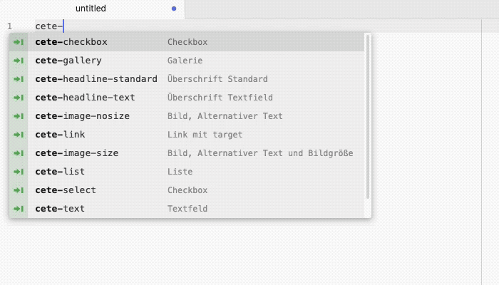

## Contao Custom Elements Snippets für Atom und VSCODE

Dieses Repo enthält Snippets zur Erstellung von [Custom Elements](https://github.com/madeyourday/contao-rocksolid-custom-elements "Custom Elements") mit den Editoren [VSCode](https://code.visualstudio.com/ "VSCode") und [Atom](https://atom.io/ "Atom").

Die entsprechenden Snippet-Dateien können bei den Editoren unter folgenden Verzeichnissen unter macOS eingefügt werden:

**Atom**: `/Users/<Username>/.atom/*`

**VSCODE** `/Users/<Username>/Library/Application Support/Code/User/snippets/*`:

### Links
- [Contao Dokumentation : Fields](https://docs.contao.org/dev/reference/dca/fields/ "Contao Dokumentation : Fields")
- [Rocksolid Custom Elements Dokumentation](https://rocksolidthemes.com/de/contao/plugins/custom-content-elements/dokumentation "Rocksolid Custom Elements Dokumentation")